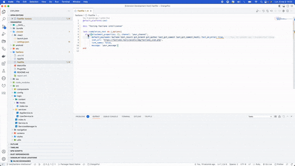

# Fastlane-Intellisense

A simple [`VSCode`](https://code.visualstudio.com/) extension to bring intellisense for [`fastlane`](https://docs.fastlane.tools/) inside of Fastfile

## Setup extension

Please open your `VSCode` command palette and search for the following command:

```txt
fastlane-intellisense: Setup required configuration
```

Simply run this command, and you are ready 😃

## 💡 Features

For the moment, this extension contains the following features:

✅ Providing basic autocompletion list with all the `fastlane` actions available

✅ `Go to definition` functionnality to navigate you to the `fastlane` action class file

✅ Documentation for each action loading in `VSCode Virtual Document`



✅ Development and production bundles handled by `Webpack`

✅ Providing documentation when hovering on action's arguments if available


`TODO`: Fix autocompletion items on server side


## 📉 Regression

- Debugger:

If the project is not compiled before running the project with the debugger, there may be some breakpoints at the begining of the `server.ts` file who will not be triggered on the first fly. If the contributor clicks on restart, then all the breakpoints on the `server` part should be triggered.

- Webpack:

Actually with the current setup, the `actions_list.json` is compiled inside the bundle.

`TODO`: fix bundle issue and remove the `actions_list.json` from the final bundle.

## 📊 Roadmap

- Add debugger support for `Fastfile`

## 📚 Ressources

- [Language Server Extension Guide](https://code.visualstudio.com/api/language-extensions/language-server-extension-guide)
- [Programmatic Language Features](https://code.visualstudio.com/api/language-extensions/programmatic-language-features)
- [`VSCode` Virtual Documents](https://code.visualstudio.com/api/extension-guides/virtual-documents)

This project was bootstaped from the `lsp-example` [repository](https://github.com/microsoft/vscode-extension-samples/tree/main/lsp-sample).

## 💻 Contributing

### 🧰 Running project locally

- Run `npm install` in this folder. This installs all necessary npm modules in both the client and server folder
- Open `VS Code` on this folder.
- Switch to the `Run and Debug` View in the Sidebar (`Ctrl+Shift+D`).
- Select `Launch Client` from the drop down (if it is not already).
- Press `▷` to run the launch config (`F5`).
- In the [Extension Development Host](https://code.visualstudio.com/api/get-started/your-first-extension#:~:text=Then%2C%20inside%20the%20editor%2C%20press%20F5.%20This%20will%20compile%20and%20run%20the%20extension%20in%20a%20new%20Extension%20Development%20Host%20window.) instance of VSCode, open a `Fastfile` handled by `ruby` language mode.
